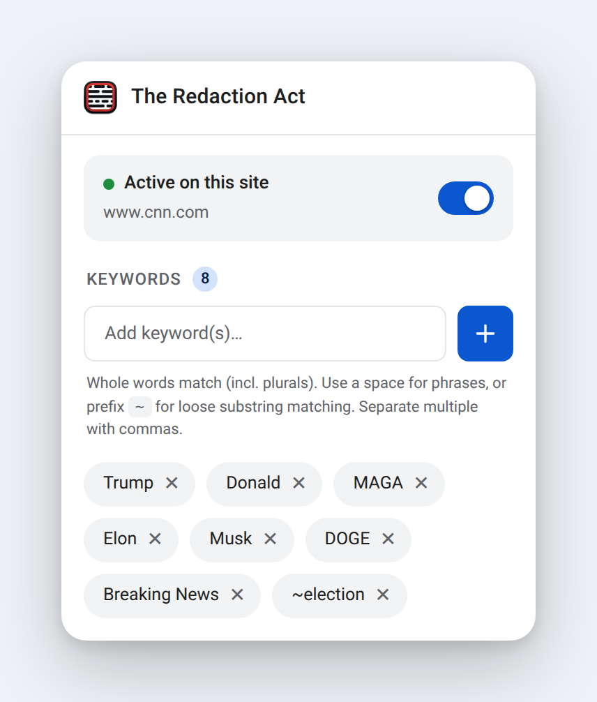
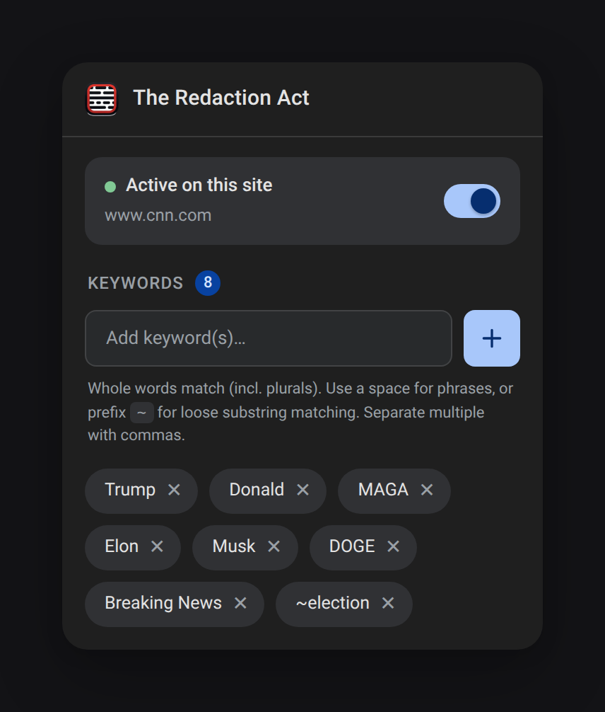
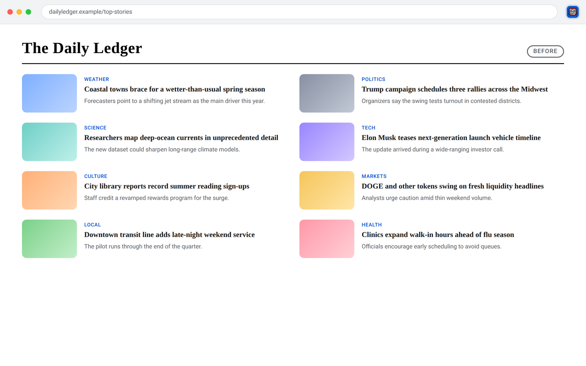
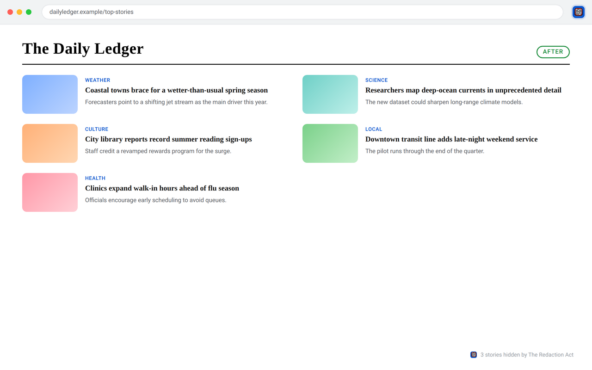

# The Redaction Act

The Redaction Act is a browser extension designed to enhance your web experience by automatically filtering out distracting content. This plugin intelligently removes entire blocks of content that match specified keywords, resulting in a more streamlined and natural page layout.

## Features

- **Intelligent Block Filtering:** Detects and removes complete repeating content blocks based on provided keywords.
- **Seamless Integration:** Operates in the background to deliver a consistent and polished browsing experience.
- **Customizable Settings:** Easily manage keywords and toggle filtering options to suit your preferences.

## Installation

### Chrome Webstore
[Click here to install the plugin via the Chrome Extension Webstore](https://chromewebstore.google.com/detail/the-redaction-act/kmefhhleokinmkeglppeebgfkbnmjhjn?authuser=0&hl=en)

### From GitHub

1. Download the extension from releases.
2. Install it on your chrome browser via unpacked extension.

## Usage

- Open the extension panel.
- Add or remove keywords as required.
- Toggle the filter off or on, to immediately apply changes on the current domain.

## Screenshots

### Popup — light &amp; dark

### Before — a feed full of noise

### After — matching stories redacted

## Disclaimer

This extension is provided as-is without any warranty. Use it responsibly and report any issues to the repository maintainers.

## About the Name

The name "The Redaction Act" originates from its initial purpose—to filter political content—but the extension is versatile and can be used to filter any type of unwanted content by specifying your own keywords.

## License

This project is licensed under the Apache License 2.0. See the [LICENSE](LICENSE) file for details.
If used in derivative works, proper attribution to "The Redaction Act" is required.
